# T2DE Architecture Mindmap

```mermaid
graph TB
    Start[User Input: Threat Report] --> Main[main.py]
    
    Main --> Parser[IntelParser]
    
    Parser --> LLM{LLM Provider}
    LLM --> Ollama[Ollama Local]
    LLM --> Anthropic[Claude API]
    LLM --> OpenAI[GPT API]
    
    Parser --> Extract[Extract Threat Intel]
    Extract --> ThreatReport[ThreatReport Model]
    
    ThreatReport --> AttackChain[Attack Chain]
    ThreatReport --> IOCs[IOCs]
    ThreatReport --> Techniques[MITRE Techniques]
    
    Parser --> Matcher[DetectionMatcher]
    Matcher --> Repos{Detection Repositories}
    Repos --> Sigma[SigmaHQ/sigma]
    Repos --> Elastic[elastic/detection-rules]
    Repos --> Atomic[Atomic Red Team]
    
    Matcher --> MatchedDetections[Matched Detections]
    Matcher --> AtomicTests[Atomic Tests]
    
    Parser --> Analyzer[CoverageAnalyzer]
    Analyzer --> Coverage[Coverage Analysis]
    Coverage --> Score[Detection Score 0-100]
    Coverage --> Grade[Coverage Grade A-F]
    Coverage --> Gaps[Critical Gaps]
    
    Parser --> Suggester[DetectionSuggester]
    Suggester --> Context[Build Attack Context]
    Context --> PrevStep[Previous Step]
    Context --> CurrentStep[Current Step]
    Context --> NextStep[Next Step]
    
    Suggester --> Indicators[Extract Indicators]
    Indicators --> Processes[Process/Commands]
    Indicators --> Files[File Operations]
    Indicators --> Network[Network Activity]
    Indicators --> IOCList[IOC List]
    
    Suggester --> GenSigma[Generate Sigma Rules]
    GenSigma --> SigmaPrompt[Context-Aware Prompt]
    SigmaPrompt --> Rationale[Why Detection?]
    SigmaPrompt --> Observed[Where in Attack?]
    SigmaPrompt --> SpecificInd[Specific Indicators]
    SigmaPrompt --> SigmaYAML[Sigma YAML Rule]
    
    Suggester --> GenHunting[Generate Hunting Queries]
    GenHunting --> HuntPrompt[Context-Aware Prompt]
    HuntPrompt --> HuntRationale[Why Hunt?]
    HuntPrompt --> HuntFocus[Focus Area]
    HuntPrompt --> Query[Splunk/KQL Query]
    
    Suggester --> GenPatterns[Extract Behavioral Patterns]
    GenPatterns --> ProcessChain[Process Chains]
    GenPatterns --> FileOps[File Operations]
    GenPatterns --> NetworkPat[Network Patterns]
    GenPatterns --> Temporal[Temporal Patterns]
    GenPatterns --> LOLBin[LOLBin Usage]
    
    Parser --> Renderer[ReportRenderer]
    Renderer --> MDReport[Markdown Report]
    
    MDReport --> Summary[Executive Summary]
    MDReport --> AttackSection[Attack Chain]
    MDReport --> IOCSection[IOCs]
    MDReport --> DetectionSection[Matched Detections]
    MDReport --> CoverageSection[Coverage Analysis]
    MDReport --> GapSection[Critical Gaps]
    MDReport --> SigmaSection[AI Sigma Rules]
    MDReport --> HuntSection[Hunting Queries]
    MDReport --> PatternSection[Behavioral Patterns]
    
    MDReport --> Output[Output File]
    
    style Start fill:#e1f5ff
    style Main fill:#fff4e1
    style Parser fill:#ffe1f5
    style Matcher fill:#e1ffe1
    style Analyzer fill:#ffe1e1
    style Suggester fill:#f5e1ff
    style Renderer fill:#e1ffff
    style Output fill:#e1f5ff
```



## Component Flow

### 1. Input Processing
```
User → main.py → IntelParser
         ↓
    Initialize LLM (Ollama/Claude/GPT)
         ↓
    Parse threat report text/URL
         ↓
    Extract structured data
```

### 2. Threat Intelligence Extraction
```
Raw Text → LLM Analysis → ThreatReport
                            ├── Attack Chain (MITRE ATT&CK)
                            ├── IOCs (IPs, Hashes, Domains)
                            └── Techniques (T-codes)
```

### 3. Detection Matching
```
Techniques → DetectionMatcher
              ├── Search Sigma Repository
              ├── Search Elastic Repository
              └── Search Atomic Red Team
                   ↓
              Matched Detections + Tests
```

### 4. Coverage Analysis
```
Attack Chain + Detections → CoverageAnalyzer
                              ├── Calculate Scores
                              ├── Assign Grades
                              └── Identify Gaps
                                   ↓
                              Critical Gaps (Prioritized)
```

### 5. AI Detection Generation (Context-Aware)
```
Critical Gaps + Attack Chain → DetectionSuggester
                                 ├── Build Context
                                 │    ├── Find related steps
                                 │    ├── Extract indicators
                                 │    └── Map attack flow
                                 │
                                 ├── Generate Sigma Rules
                                 │    ├── Why detection?
                                 │    ├── Where observed?
                                 │    └── Specific indicators
                                 │
                                 ├── Generate Hunting Queries
                                 │    ├── Why hunt?
                                 │    ├── Focus area
                                 │    └── Query (Splunk/KQL)
                                 │
                                 └── Extract Patterns
                                      └── Behavioral sequences
```

### 6. Report Generation
```
All Data → ReportRenderer → Markdown Report
                             ├── Executive Summary
                             ├── Attack Visualization
                             ├── Detection Coverage
                             ├── AI Suggestions
                             └── Actionable Intelligence
```

## Data Flow

```
┌─────────────────┐
│  Threat Report  │
└────────┬────────┘
         │
         ▼
┌─────────────────┐
│   LLM Parser    │
└────────┬────────┘
         │
         ▼
┌─────────────────┐
│ ThreatReport    │
│  - Attack Chain │
│  - IOCs         │
│  - Techniques   │
└────────┬────────┘
         │
         ├──────────────────┐
         │                  │
         ▼                  ▼
┌─────────────────┐  ┌─────────────────┐
│ Detection       │  │ Coverage        │
│ Matcher         │  │ Analyzer        │
│  - Sigma        │  │  - Scores       │
│  - Elastic      │  │  - Grades       │
│  - Atomic       │  │  - Gaps         │
└────────┬────────┘  └────────┬────────┘
         │                    │
         └──────────┬─────────┘
                    │
                    ▼
         ┌─────────────────┐
         │ Detection       │
         │ Suggester       │
         │  - Context      │
         │  - Sigma Rules  │
         │  - Hunting      │
         │  - Patterns     │
         └────────┬────────┘
                  │
                  ▼
         ┌─────────────────┐
         │ Report          │
         │ Renderer        │
         └────────┬────────┘
                  │
                  ▼
         ┌─────────────────┐
         │ Markdown Output │
         └─────────────────┘
```

## Key Design Patterns

### 1. **Separation of Concerns**
- Each module has a single responsibility
- Parser → Matcher → Analyzer → Suggester → Renderer

### 2. **Context-Aware Generation**
- Detections are tailored to the specific attack
- Not generic technique-based rules
- Includes rationale and attack chain mapping

### 3. **Pydantic Models**
- Type-safe data structures
- Validation at runtime
- Clear data contracts

### 4. **LLM Abstraction**
- Support multiple providers
- Consistent interface
- Easy to add new providers

### 5. **Repository Integration**
- Local cloning for offline use
- Automatic updates
- Fast searching

## Performance Considerations

```
LLM Calls per Run:
├── 1 call: Parse threat report
├── 3 calls: Generate Sigma rules (for top 3 gaps)
├── 3 calls: Generate hunting queries (for top 3 gaps)
└── 1 call: Extract behavioral patterns
    
Total: 8 LLM calls
Time: ~40-240 seconds (depending on provider/model)

Optimization:
- Default to single query type (Splunk only)
- Set ENABLE_MULTI_QUERY_TYPES=true for comprehensive coverage